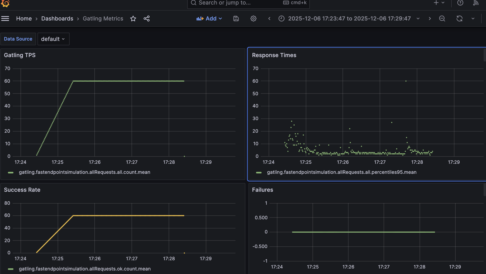
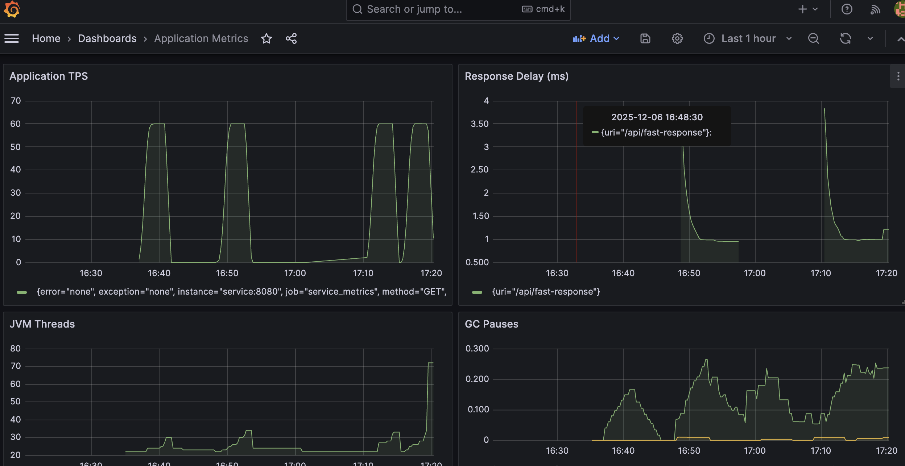

# Gatling Example Performance Stack

A reproducible performance-testing playground that exercises a Spring Boot 3.3 service with Gatling 3.11 simulations while exporting metrics to InfluxDB (Graphite input) and visualising them in Grafana. Docker Compose orchestrates the full stack so you can spin everything up locally with one command.

## Stack Overview
- **Service**: Spring Boot REST API packaged as a runnable JAR (Java 17).
- **Load**: Gatling Scala simulations (Fast/Slow endpoints, feeders, pauses) executed via the Maven plugin.
- **Metrics pipeline**: Gatling Graphite writer → InfluxDB 1.8 (graphite listener) → Grafana dashboards. Prometheus scrapes the service for JVM/application metrics in parallel.
- **Dashboards**: Provisioned Grafana board that charts TPS, latency percentiles, success rate, and failures from InfluxDB.

## Prerequisites
- Docker & Docker Compose (v2).
- Java 17 and Maven 3.9+ (for Gatling build/run from the host).

## Quick Start
1. Build and launch everything:
   ```bash
   docker compose up -d --build
   ```
2. Wait for Grafana (`http://localhost:3000`, default admin/admin — log in with `admin:admin`) and InfluxDB (`http://localhost:8086`) to report healthy status.
3. Trigger a Gatling default test run (emits metrics to InfluxDB):
   ```bash
   mvn -pl gatling gatling:test
   ```
    or to run a specific test
```bash
   mvn -pl gatling gatling:test -Dgatling.simulationClass=xxx
   ```

4. Open the "Gatling Metrics" dashboard in Grafana and select a time range covering the run (e.g., Last 6 hours). Panels should display data immediately after the simulation completes.

## Grafana Dashboards
Two curated Grafana boards ship with the stack so you can correlate Gatling load against JVM health immediately:

- **Gatling Metrics**: Shows request throughput, latency buckets, and error rate streamed from InfluxDB/Graphite to validate every run at a glance.


- **Application Metrics**: Uses Prometheus-scraped Micrometer data to track TPS, response delay, live threads, and GC pauses from the Spring Boot service.



## Project Structure
- `service/`: Spring Boot 3.3 application that exposes `/api/fast-response`, `/api/slow-response`, and Actuator metrics under `/private/metrics`. Micrometer is configured for Prometheus scraping with histogram buckets that back the Application Metrics dashboard.
- `gatling/`: Scala module that houses reusable `SimulationUtils` helpers plus Gatling simulations compiled by Maven. This module owns the `gatling.conf` that enables the Graphite writer targeting InfluxDB.
- `infrastructure/`: Docker assets for Grafana, Prometheus, and InfluxDB. Includes provisioning (`grafana/`), scrape configs (`prometheus/`), and an auxiliary Maven POM for container-friendly builds.
- `docker-compose.yml`: Orchestrates the full stack (service + Gatling metrics pipeline + monitoring).
- `docs/`: Long-form writeups such as `docs/article-gatling-tests.md` that capture experiment notes and how-to guides.
- `plan.md`: Running delivery log that tracks scope, assumptions, and the state of each phase.

## Current Load Tests
- `FastEndpointSimulation`: Exercises `/api/fast-response` at ~60 req/s with a 60 s ramp and 3 minute steady state. Assertions enforce >95% success and <10 s max latency. Ideal for verifying baseline throughput and catching regressions quickly.
- `SlowEndpointSimulation`: Targets `/api/slow-response` with ~20 req/s, the same 60 s warm-up, and a 4 minute hold to surface back-pressure behavior. Shares the success/latency assertions to guarantee the slow path still meets SLOs.

Both simulations use the shared `SimulationUtils` chain builder so pauses, protocols, and feeder hooks stay consistent. Trigger either one with `mvn -pl gatling gatling:test -Dgatling.simulationClass=...`.

## Operational Notes
- **Service only**: `docker compose up -d service` brings up just the Spring Boot API for debugging.
- **Stopping the stack**: `docker compose down` (add `-v` to drop InfluxDB/Prometheus volumes if you need a clean slate).
- **InfluxDB introspection**: run ad-hoc queries, e.g.
  ```bash
  curl -G 'http://localhost:8086/query' \
       --data-urlencode 'db=graphite' \
       --data-urlencode 'q=SHOW MEASUREMENTS LIMIT 20'
  ```
  The Gatling graphite writer emits measurements like `gatling.<simulation>.<scope>.<bucket>.<stat>`.
- **Prometheus verification**: confirm the application histogram data exists before troubleshooting Grafana:
  ```bash
  curl -s 'http://localhost:9090/api/v1/query?query=rate(http_server_requests_seconds_count{uri=~"/api/(fast|slow)-response"}[1m])'
  curl -s 'http://localhost:9090/api/v1/query?query=histogram_quantile(0.95,%20sum(rate(http_server_requests_seconds_bucket{uri=~"/api/(fast|slow)-response"}[5m]))%20by%20(le,%20uri))%20*%201000'
  ```
  Both queries return `[]` (empty) until you send traffic.

## When Configurations Change
- Grafana copies provisioning files into the image at build time. **Any change** to `infrastructure/grafana/provisioning/**` or dashboards requires rebuilding the Grafana service:
  ```bash
  docker compose build grafana && docker compose up -d grafana
  ```
  (Or simply `docker compose up -d --build grafana`.) Without this step you will still see the old dashboards/data sources inside the container.
- Updates to the service, Prometheus, or Influx containers likewise need a rebuild of the respective service (`docker compose up -d --build <service>`). For example, actuator/metrics configuration tweaks in `service/src/main/resources/application.yml` require `docker compose up -d --build service` so Prometheus sees the histogram settings used by the Application Metrics dashboard.

## Troubleshooting
- **No metrics in Grafana** but InfluxDB has data: ensure Grafana was rebuilt after dashboard edits and the datasource points to `InfluxDB / graphite` (already provisioned by default).
- **Gatling fails to emit**: confirm `gatling/src/test/resources/gatling.conf` still enables the graphite writer and that port `2003` is mapped locally (`docker compose ps`).
- **Validation**: query InfluxDB for recent samples to verify the pipeline before blaming Grafana, e.g.
  ```bash
  curl -G 'http://localhost:8086/query' \
       --data-urlencode 'db=graphite' \
       --data-urlencode 'q=SELECT value FROM "gatling.fastendpointsimulation.allRequests.all.count" ORDER BY time DESC LIMIT 5'
  ```

## Next Steps
- Extend simulations with additional feeders or ramp profiles to mimic real traffic.
- Wire Grafana to Prometheus panels for JVM/system metrics to correlate with Gatling load curves.
- Add CI automation that runs `mvn -pl gatling gatling:test` with assertions for regression detection.
